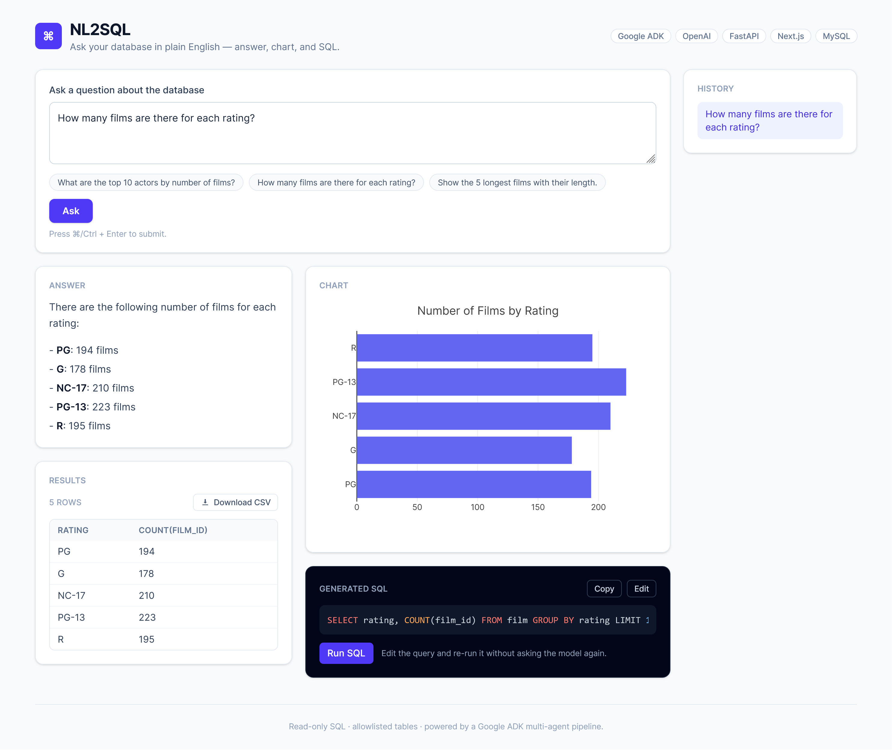
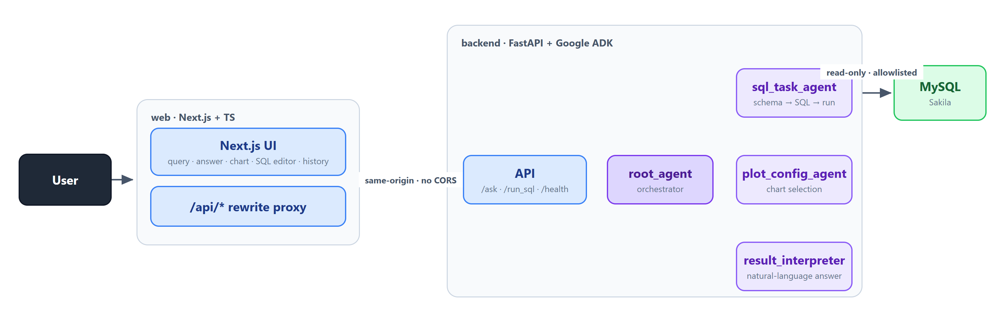

<h1 align="center">NL2SQL</h1>

<p align="center">
  <b>Ask your database in plain English — get an answer, a chart, and the exact SQL behind it.</b>
</p>

<p align="center">
  
  
  
  
  
  
  
  
  
</p>

<!-- HERO: one full-page screenshot after answering "How many films are there for each rating?"
     The single shot should show answer + bar chart + results table + SQL panel + history. ~1440px wide. -->
<p align="center">
  
</p>

A natural-language-to-SQL agent built on **Google ADK**. A four-agent pipeline turns a
plain-English question into a read-only SQL query, runs it, explains the result, and picks
the right chart — and the UI shows you the generated SQL so you can read, edit, and re-run it.

---

## The problem

"Self-serve analytics" usually means one of two things: a BI tool that still requires you to
know the schema, or an LLM that emits SQL you have to trust blindly. Neither is safe to hand
to someone who just wants an answer.

NL2SQL takes a different stance:

- **Every answer is auditable** — the generated SQL is shown, syntax-highlighted, and editable.
- **Execution is locked down** — only `SELECT`/`SHOW`/`DESCRIBE`/`EXPLAIN` run, against an
  allowlist of tables. A keyword scan rejects anything that writes.
- **The work is decomposed, not hand-waved** — separate agents own SQL generation, chart
  selection, and natural-language explanation, each with a focused prompt and tools.

---

## Walkthrough

> Database: the classic [Sakila](https://dev.mysql.com/doc/sakila/en/) sample DVD-rental schema.

Ask **"How many films are there for each rating?"** (the screenshot above). The model writes
the SQL, the pipeline runs it, and the result is explained and charted:

```sql
SELECT rating, COUNT(film_id) AS film_count FROM film GROUP BY rating LIMIT 100
```

> There are 1,000 films across 5 ratings — PG-13 leads with 223, followed by NC-17 (210),
> R (195), PG (194), and G (178).

Every answer comes with three things visible at once: the **chart**, the **results table**
(with CSV export), and the **generated SQL** — which you can **edit and re-run** directly,
with no second model call. Past questions land in the **history** panel.

---

## Architecture

<p align="center">
  
</p>

The `root_agent` orchestrates the pipeline as tool calls: load schema → generate & run SQL →
build a `plot_config` → write the answer → assemble the final JSON. The frontend then calls
`/run_sql` to fetch the rows that back the chart and table. See
[docs/ARCHITECTURE.md](docs/ARCHITECTURE.md) for the full agent/tool/state breakdown.

---

## Quick start

You need an **OpenAI API key**. Copy the env template and fill it in:

```bash
cp .env.example .env       # then set OPENAI_API_KEY
```

### Docker (recommended)

Brings up MySQL (auto-seeded with Sakila), the FastAPI backend, and the Next.js UI:

```bash
docker compose up --build
```

Open **http://localhost:3000**. To wipe and re-seed the database:

```bash
docker compose down -v && docker compose up
```

### Local development

Requires Python 3.12, Node 20+, and a local MySQL 8 with the Sakila database loaded.

```bash
# 1. Backend (http://127.0.0.1:8080)
pip install -r requirements.txt
python app/server.py

# 2. Frontend (http://127.0.0.1:3000) — proxies /api/* to the backend
cd web
npm install --legacy-peer-deps
npm run dev
```

Set `MYSQL_HOST=127.0.0.1` in `.env` for local MySQL (Docker uses `db`).

---

## Configuration

All configuration is via `.env` (see [.env.example](.env.example)).

| Variable | Purpose | Default |
| --- | --- | --- |
| `AI_PROVIDER` | `openai` (default) or `azure` | `openai` |
| `OPENAI_API_KEY` | OpenAI API key (for `openai`) | — |
| `AI_API_KEY` / `AI_ENDPOINT` / `AI_API_VERSION` | Azure OpenAI (for `azure`) | — |
| `AI_MODEL` | Default model for all agents | `gpt-4o-mini` |
| `ROOT_MODEL`, `SQL_TASK_MODEL`, `PLOT_CONFIG_MODEL`, `RESULT_INTERPRETER_MODEL` | Per-agent model overrides | per-agent |
| `MYSQL_HOST` / `PORT` / `USER` / `PASSWORD` / `DATABASE` | Database connection | — |
| `MYSQL_POOL_SIZE` | Connection-pool size | `5` |
| `ALLOWED_TABLES` | Comma-separated table allowlist | `actor,film` |
| `MAX_ROWS` | Row cap per query | `200` |

> **Model names matter.** With `AI_PROVIDER=openai`, use real OpenAI ids (`gpt-4o`,
> `gpt-4o-mini`). The chart-selection agent (`PLOT_CONFIG_MODEL`) defaults to `gpt-4o`
> because it must call a tool reliably — see Design decisions.

---

## Tech stack

| Layer | Technology |
| --- | --- |
| Agents | Google ADK, LiteLLM, OpenAI (`gpt-4o` / `gpt-4o-mini`) |
| Backend | FastAPI, Uvicorn, `mysql-connector-python` (pooled), `sqlparse` |
| Frontend | Next.js 16 (App Router), TypeScript, Tailwind CSS, Plotly, highlight.js |
| Data | MySQL 8 (Sakila sample database) |
| Infra | Docker, Docker Compose |

---

## Project structure

```
adk_nl2sql/
├── app/                      # FastAPI server
│   ├── server.py             #   app factory + uvicorn entrypoint
│   ├── api.py                #   /ask, /run_sql, /health
│   └── schemas.py            #   Pydantic request models
├── nl2sql/                   # Agent pipeline
│   ├── agent.py              #   root_agent definition
│   ├── agents/               #   sub-agents + model_provider (OpenAI/Azure switch)
│   ├── prompts/              #   one prompt module per agent
│   ├── tools/                #   agentic tools, SQL tools, plot tools
│   ├── database/             #   pooled MySQL client
│   └── config.py             #   env → AppConfig
├── web/                      # Next.js frontend
│   └── src/
│       ├── app/              #   layout + page composition
│       ├── components/       #   QueryPanel, ChartView, SqlEditor, ResultsTable, …
│       ├── hooks/            #   useNl2Sql (ask → run_sql → render)
│       └── lib/              #   api client, types, plot builder, csv export
├── docker/mysql-init/        # Sakila seed (runs on first DB boot)
├── docker-compose.yml        # db + backend + web
├── Dockerfile                # backend image
└── web/Dockerfile            # frontend image (Next standalone)
```

---

## Design decisions

- **Provider-agnostic LLM layer.** `model_provider.py` selects OpenAI or Azure from a single
  `AI_PROVIDER` env var via LiteLLM, so the same agent code runs on either backend — only
  config changes.
- **Same-origin proxy instead of CORS.** The browser only ever calls `/api/*`; Next's
  `rewrites` forward those to FastAPI. No preflight, no CORS config, and only `BACKEND_ORIGIN`
  changes between local and Docker.
- **Pooled DB connections.** `/run_sql` is synchronous and runs in Starlette's threadpool, so
  a shared single connection would be corrupted by concurrent requests. The client uses a
  `MySQLConnectionPool` and acquires/releases per call.
- **Reliable tool-calling.** The chart agent must *call* `save_plot_config`, not print JSON.
  A smaller model did the latter intermittently, so the chart agent runs on `gpt-4o`, which
  follows the tool contract — fixed at the source rather than papered over downstream.
- **Separate Node service for the UI.** Keeping the Next.js server as its own container (vs. a
  static export served by FastAPI) preserves the rewrite proxy and mirrors a real deployment.

---

## Security

- Read-only execution: only `SELECT` / `WITH` / `SHOW` / `DESCRIBE` / `EXPLAIN` are allowed.
- A keyword scan rejects `INSERT`/`UPDATE`/`DELETE`/`DROP`/`ALTER`/… before anything runs.
- Schema inspection and queries are limited to `ALLOWED_TABLES`.
- `/run_sql` (used for the editable SQL box) reuses the exact same validation.

## Limitations

- SQL quality depends on the model and the allowlisted schema it can introspect.
- Charts cover the common cases (bar, column, line, pie, table); exotic visualizations fall
  back to a table.
- Query history is in-session only (no persistence by design).

---

<p align="center">
  <sub>Built with a four-agent relay, read-only SQL bouncers, a connection pool, and a SQL box you can actually edit.</sub>
</p>
